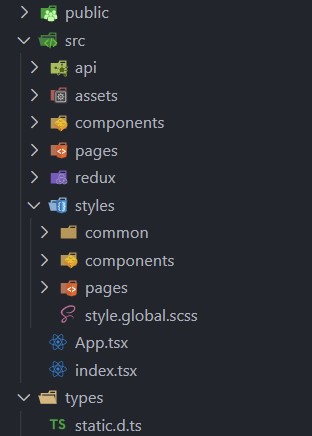
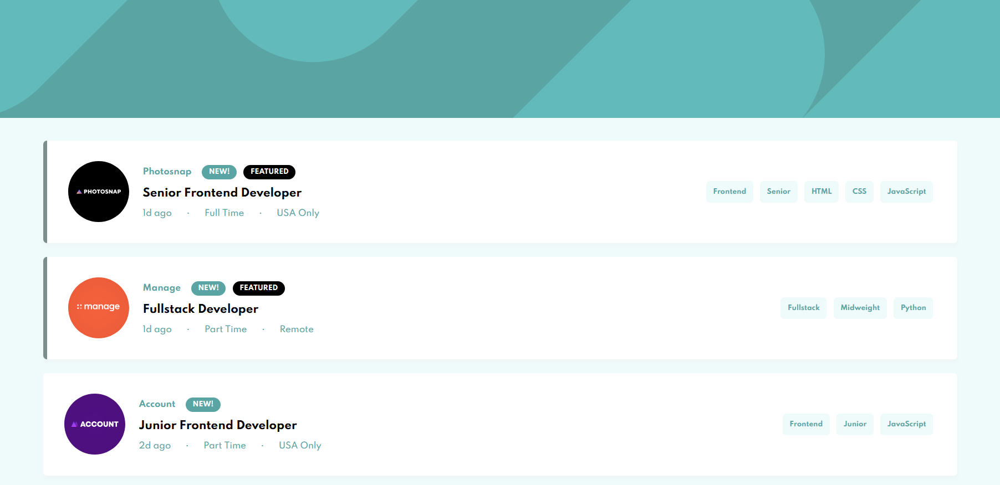
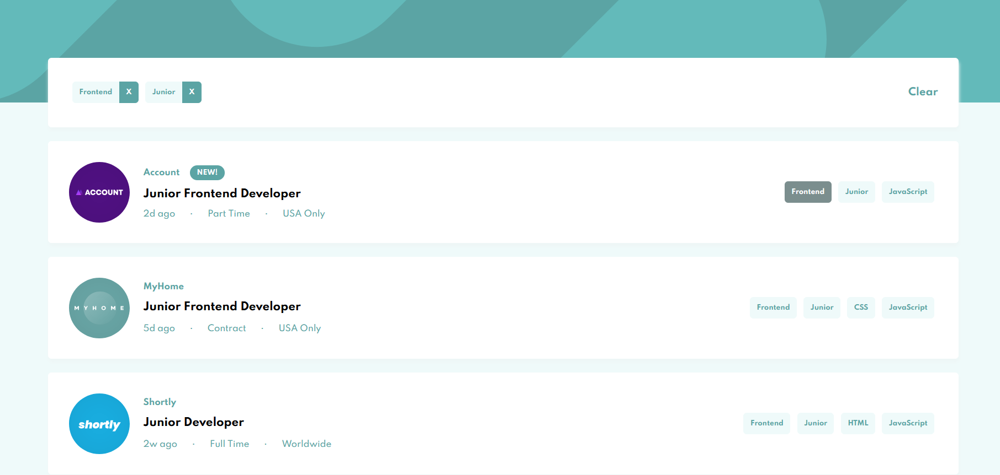
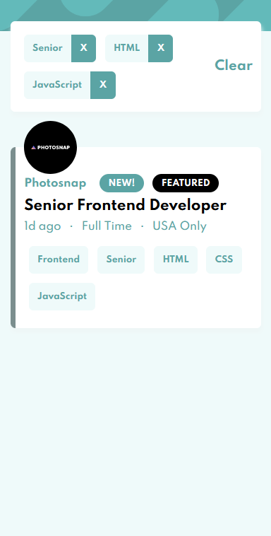

# Job Listings with Filtering

> Front-end challenge @ frontend Mentor

[Go to challenge Link](https://www.frontendmentor.io/challenges/job-listings-with-filtering-ivstIPCt)

## How to Start?

```javascript
npm i
npm run start

go to http://localhost:8080 !
```

or [see result below](#Result)

## Skill Stack

### React.js + Typescript

React is easy for making apps with component-based structure. Also, Typescript can find errors before app deploys. And Typescript make easy to make a rule with team project.

### Redux(w/ Redux toolkit) for State mgt

> This project is very small, simple. So, in this case I don't need state library. But, it's practice! When app size is larger than this, It must to be with some kind of 3rd party state library.

I use Redux library for state management. Original redux needs a lot of boilerplate codes to work. But, redux toolkit don't need anymore that kind of boilerplate codes.

I use `createSlice` to define reducer, action. It's very useful and easy to use. I used redux 2 years ago. At that time, it's too complicate to use. But now, it's tech huddle is not so high than before because of `redux-toolkit`!

#### Folder structure



I prefer to divide `business logic component` and `just view component`. It's easier to understand whole project logic and maintain this.

I select CSS modules in CSS styling. All styling CSS files are in `styles` folder, and the destinations are same with components using.

## Result

[**Link to result page**](https://wizardly-archimedes-11f65e.netlify.app/)(w/ Netlify hosting)

### Screenshot(for busy users)

- For desktop

  

  

- For mobile

  

  
